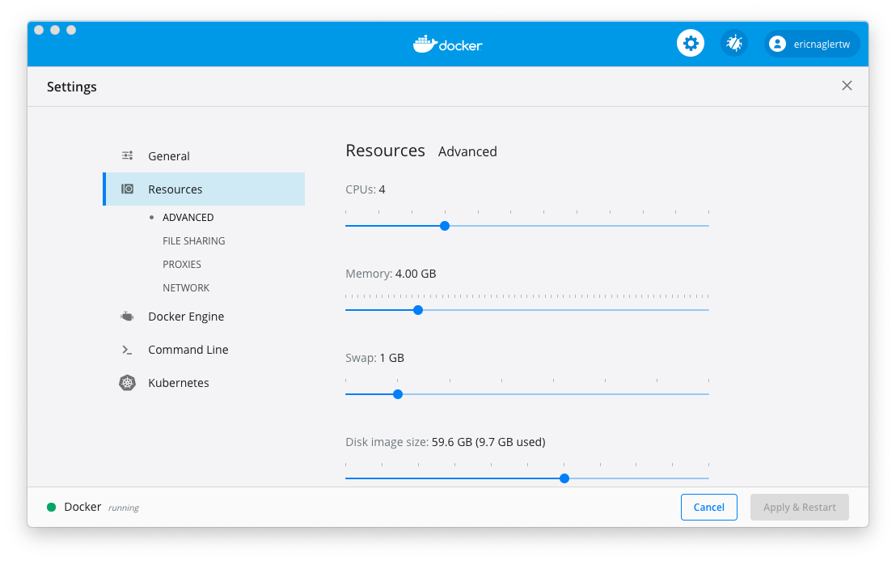

## Setting up your environment 

## Goals

* Setup a development environment for CD4ML including:
* Fork Git Code Repository into Personal GitHub
* Configuring a python code development environment

## Github Setup
Navigate to the [Github Personal Access Tokens page](https://github.com/settings/tokens).

Click "Generate new token" on the top right. You may need to enter your Github password again.

Enter a Note for your personal access token and select the "repo" and "user:email" permissions. Click "Generate Token".

Your personal access token will be created and displayed to you. Make sure you save this token safely because it will not be shown again.

Fork the following [repository](https://github.com/ThoughtWorksInc/cd4ml-scenarios) into your personal github account.

## Increase Docker Desktop Resources
Open Docker Desktop by clicking on the docker icon in your Mac or Windows taskbar and selecting Dashboard. Click the gear and select "Resources" and then "Advanced". Increase the RAM allocated to docker to 4 Gigabytes. Click "Apply and Restart".



## Select your development environment
In the next section you can choose from one of two different application development environments either using a local machine based development environment or a JupyterLab based development environment. When completing the scenario there is no difference between the two environments. We recommend that if you are more comfortable with the JupyterLab development IDE and environment then select JupyterLab otherwise use your already existing development environment.

### Local machine environment
For this workshop we are going to use python3 as our python, pip3 as our dependency manager, and virtualenv for python environment management.

First you need to fork this repo to your github account and then clone this environment to your local machine

After you install python run the following commands to start your environment
```bash
git clone https://github.com/<Your User Name>/CD4ML-Scenarios
cd <cloned repo>
docker-compose up -d --build --remove-orphans
pip3 install virtualenv
virtualenv --python=python3 .venv

# On Mac/Linux run the following
source .venv/bin/activate
pip3 install -r requirements.txt

# On Windows Powershell Run:
Set-ExecutionPolicy RemoteSigned
.venv/Scripts/activate.ps1
pip3 install -r requirements.txt
```

## Setting up your local environment (using JupyterLab Development Environment)
If you are running the environment on a MS Windows 10 machine, make sure to switch Docker to Linux-containers.
You can do this by clicking on the little Docker icon in the Windows taskbar.
You also need to make sure that your PC can handle virtual environments. This can be switched on or off our systems BIOS.

## JupyterLab Development Environment
1. Clone the environment to your local machine using `git clone https://github.com/<Your User Name>/CD4ML-Scenarios`
2. Run `docker-compose up -d --build --remove-orphans` to download the images and start the environment
3. Run the following command to retrieve the URL for docker. 
```bash
docker logs dev
```
You will see a URL such as `http://127.0.0.1:8888?token=<token>`. Open that url in your web browser

4. From the JupyterLab environment you can open a terminal window by clicking the terminal tile on the home page. Run the following
```bash
pip install -r requirements.txt
```

### Next Steps

At this step you can start setting up the different components of CD4ML. Continue to the [next section](https:///github.com/ThoughtworksInc/CD4ML-Scenarios/blob/master/instructions/2-SetupJenkins.md).