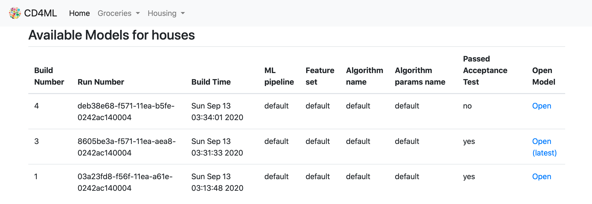

# Exercise 4 - Continuous Delivery

## Goals

* Learn about the principles of Continuous Deployment
* Demonstrate a CD quality check, ensuring that our changes don't impact production applications

## Step by Step Instructions

In the following exercise we are going to demonstrate how a continuous deployment check can ensure that errors if introduced do not impact an application running in production. This ensures a continuous deployment cycle and that deploying to production is easy and a non-event. To simulate this we are going to adjust the acceptance threshold too high to reject the model, but other additional reasons including:

* Data changing when re-training, causing a performance drop
* Unintended code adjustments effecting training pipeline

1. Let's copy the values from our `odsc_europe.json` experiment into `cd4ml/problems/houses/algorithm/random_forest/default.json`. Afterwards, our file should look like this:
    ```json
    {
        "n_estimators": 200,
        "max_features": 0.4
    }
    ```
2. We also need to adjust the `cd4ml/problems/houses/ml_pipelines/default.json` file to represent the higher model acceptance threshold. Open this file and change the `acceptance_threshold_min` from `0.42` to `0.50`
3. Commit our code using:
    ```bash
    git add .
    git commit -m "Adjust max_features to 0.4, acceptance_threshold to 0.5"
    ```
4. After running the pipeline we should see the pipeline go read indicating a build error:
   
5. The logging error indicates a build error, and that trained model score was not accepted. We can see that this error does not impact the production model because if we navigate to the all [models listing](http://localhost:11000/houses/models) of the housing scenario it indicates that the new model is not the latest model, hence is not what production uses (Build Number 3).

    
    
Let's correct this problem, we are going to revert our incorrect commit and replace it with a new commit with everything corrected. Run the following command.
```sh
git revert HEAD
```
This will revert the last commit you performed and your environment will have the previous values.
Correct both `cd4ml/problems/houses/algorithm/random_forest/default.json` (see above) and `cd4ml/problems/houses/ml_pipelines/default.json` to 0.45.

```sh
git add .
git commit -m "Adjust max_features to 0.4, acceptance_threshold to 0.45"
git push
```
After you push your code your pipeline should be green and you can refresh your model listing page to show that your latest build will be model used in production.

Next, let's visualize our results. Continue to [Kibana Visualization](./5-KibanaLogVisualization.md)