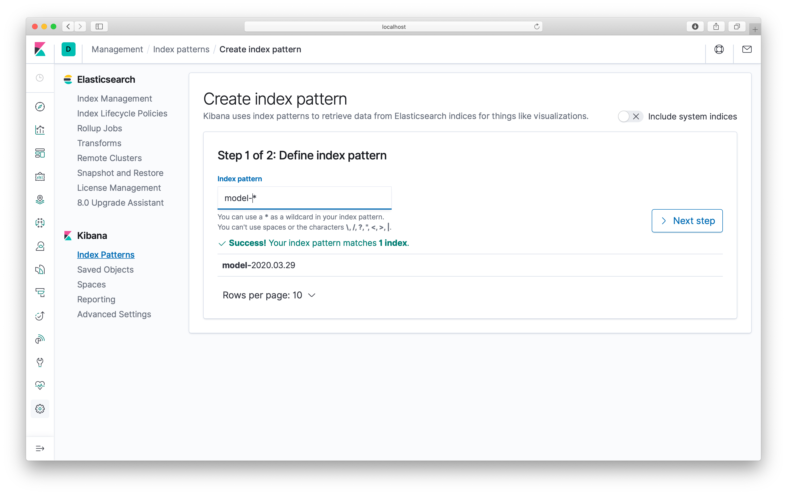
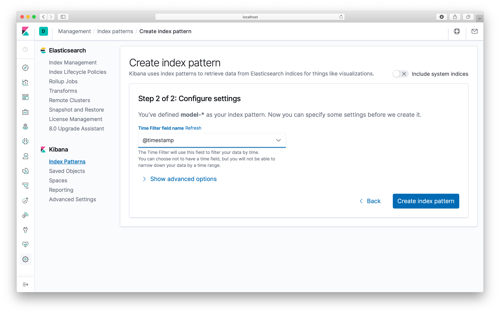
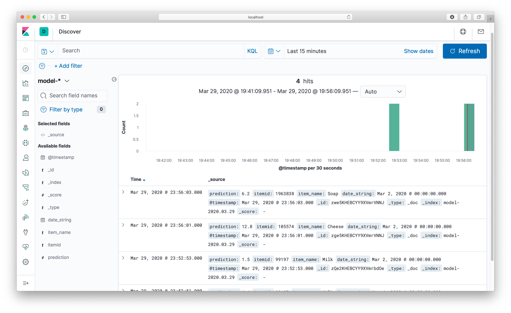

# Exercise 5: Model Monitoring and Observability

## Goals

* Learn about EFK Stack ([Elasticsearch](https://www.elastic.co/products/elasticsearch),
[FluentD](https://www.fluentd.org/), and [Kibana](https://www.elastic.co/products/kibana))
* Configure and deploy our application to log prediction events to Elastic Search
* Visualize events on Kibana dashboard
* Learn how to close the data feedback loop

## Introduction

To close the data feedback loop, we can log events in production to collect data about how our model is performing against real data. This data can later be curated and labeled to improve the dataset used during training. This allows us to continuously improve our models in production!

In this workshop, we use the EFK stack for our monitoring and observability infrastructure. It is composed of three main components:

* [Elasticsearch](https://www.elastic.co/products/elasticsearch): an open source search engine.
* [FluentD](https://www.fluentd.org/): an open source data collector for unified logging layer.
* [Kibana](https://www.elastic.co/products/kibana): an open source web UI that makes it easy to explore and visualize the data indexed by Elasticsearch.

## Step by Step instructions

1. Ensure that you have run the Jenkins Pipeline recently to have a model loaded.
2. Navigate to the [Model Service](http://localhost:11000)
3. Select a time and a product and click Submit
4. Navigate to [Kibana](http://localhost:5601)

5. When the page loads click the "Discover" Compass on the top left. This will take you to the "Create Index Pattern" Page. Enter `model-*` as the index pattern. Click "Next Step"

6. On the "Configure Settings" page, make sure `@timestamp` is selected from the "Time Filter Field name" dropdown. Click "Create Index Pattern". 

7. Click the Discover Compass on the top left again and you should able to visualize your model logs and see the times, product names and predictions that were made

To stop the environment run: `docker-compose down`

You don’t need to use the same tools we chose to implement CD4ML. Get in touch with us if you want to learn how to run this workshop with your teams in your company!

